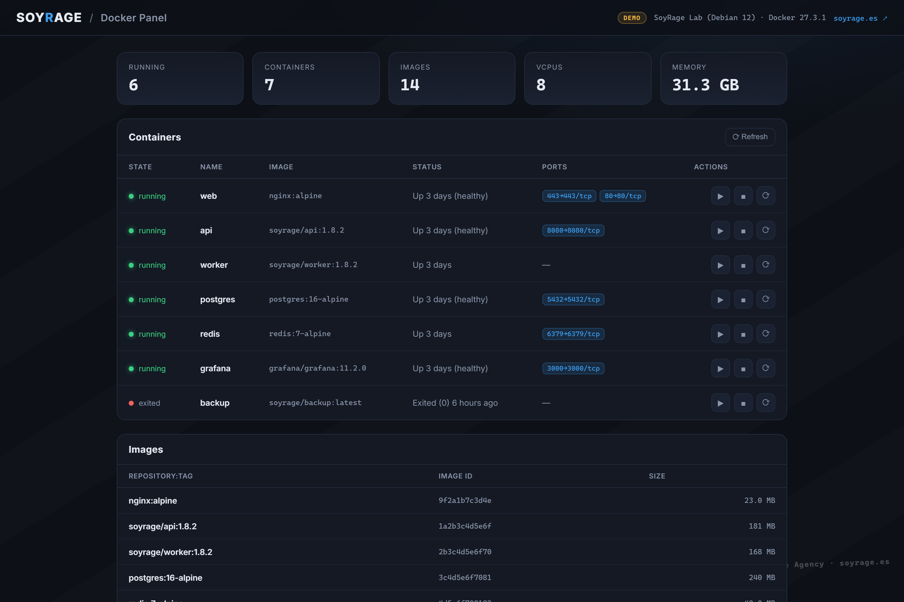
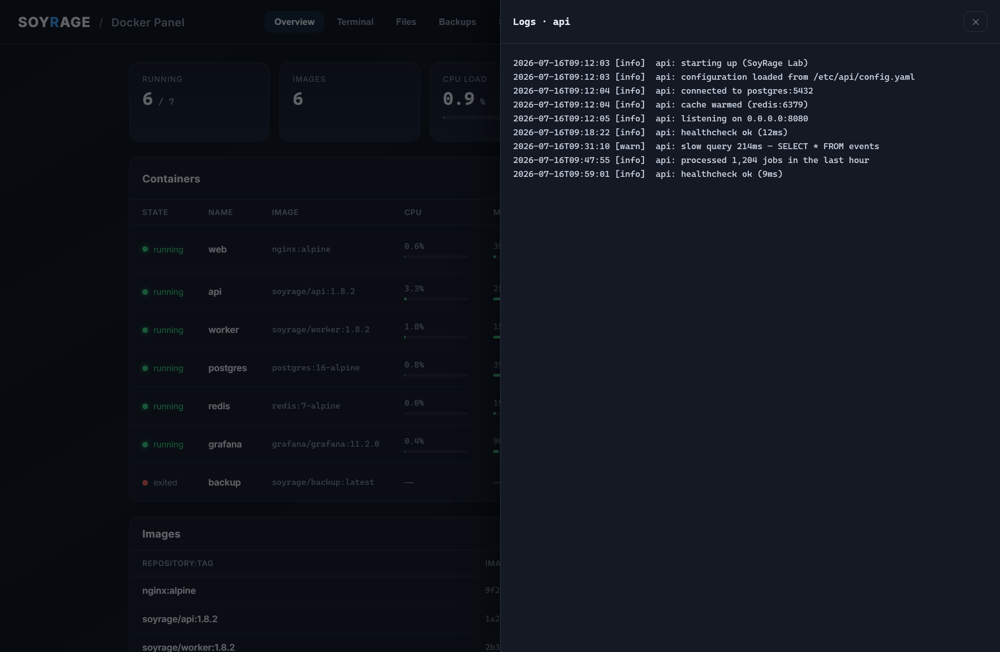
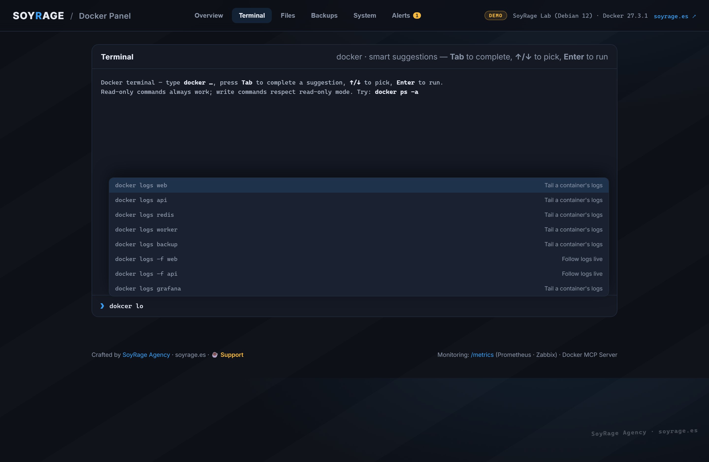
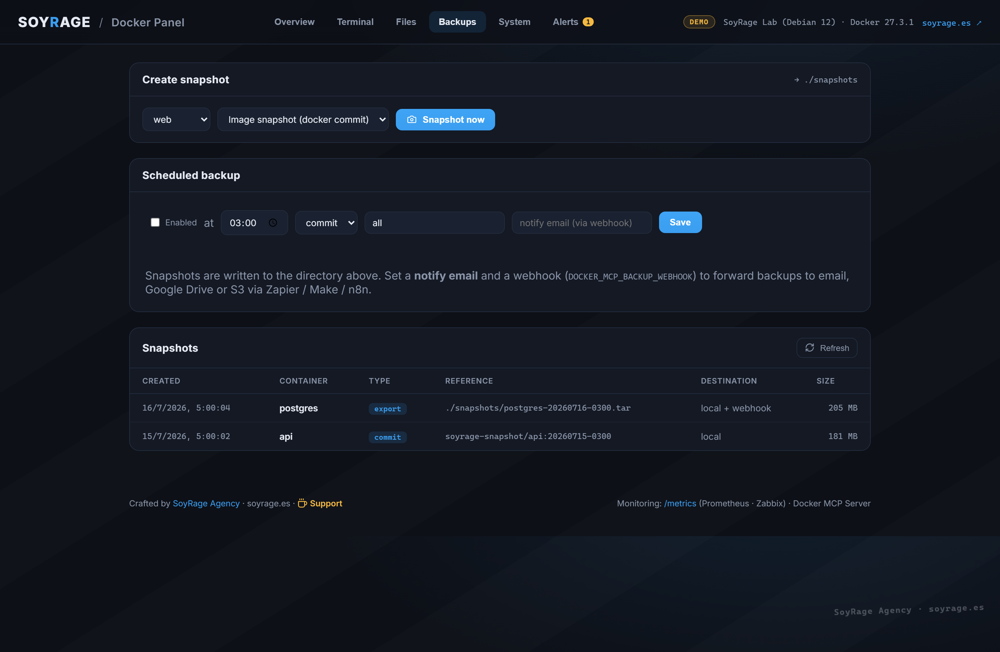
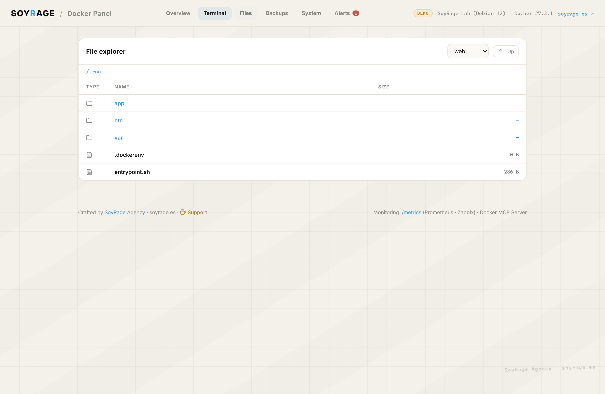
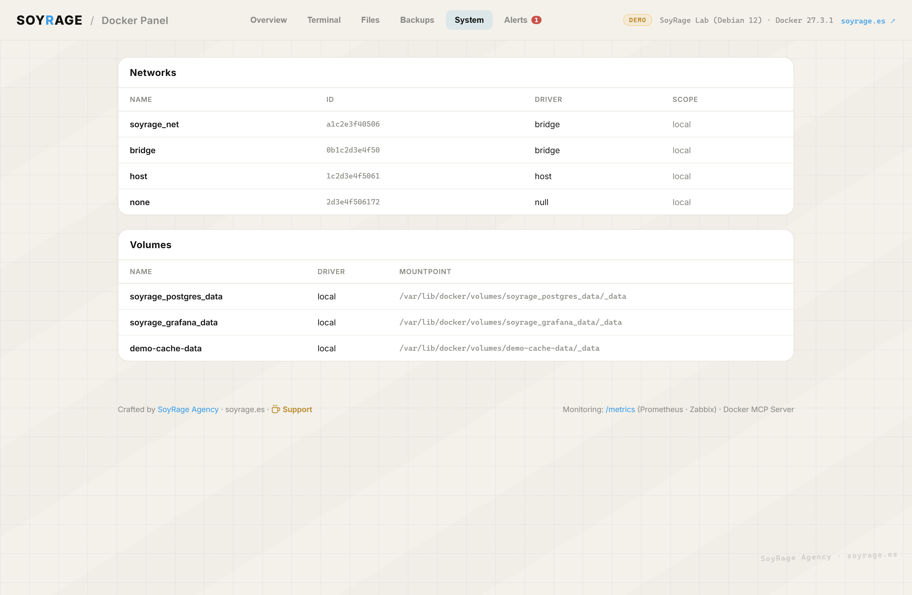
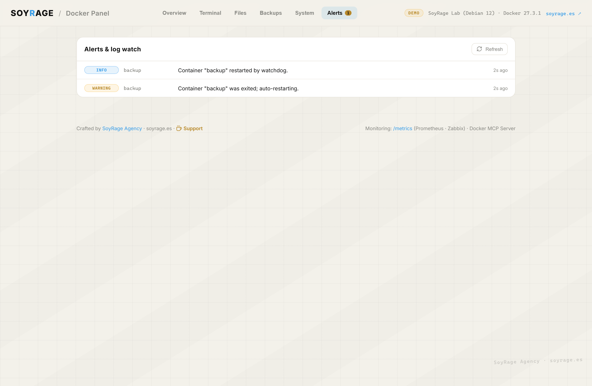
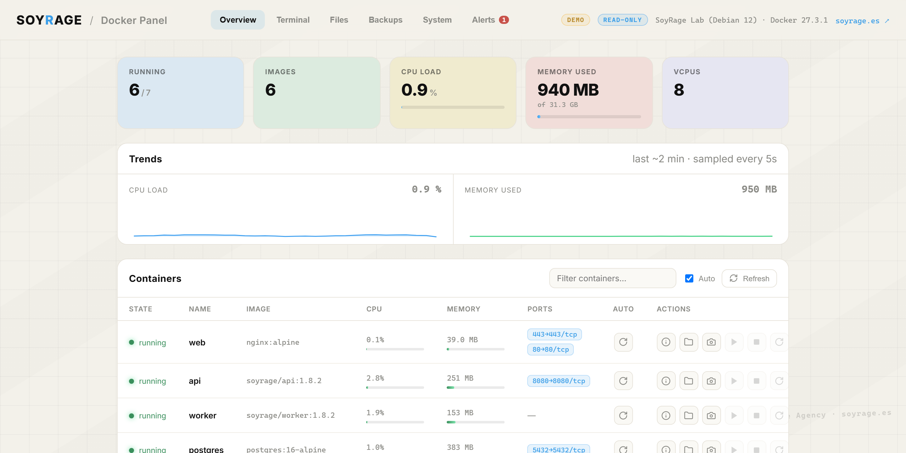
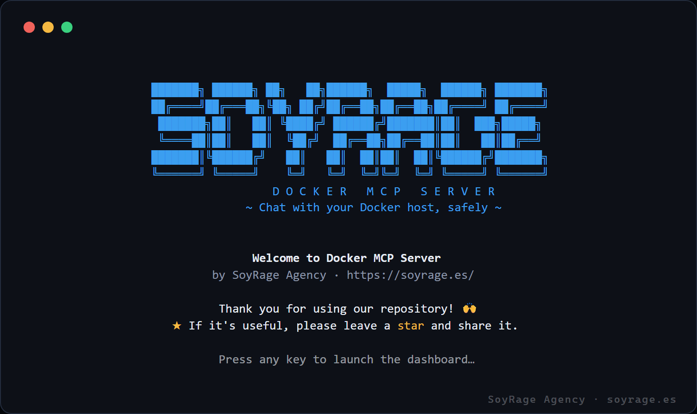
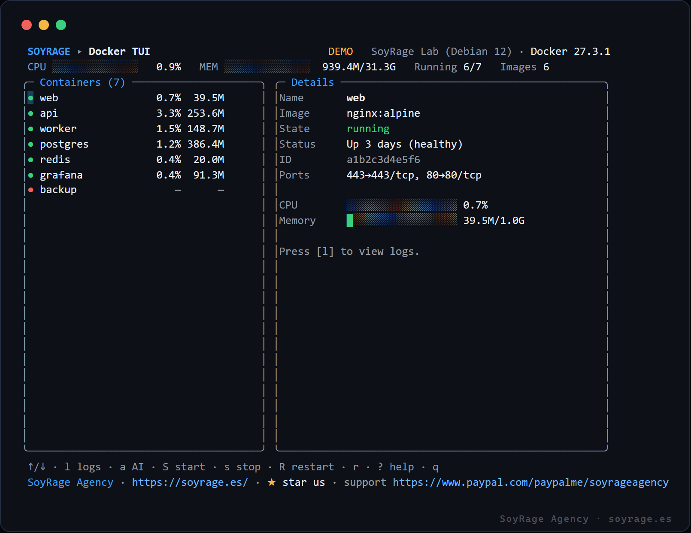

<div align="center">

<a href="https://soyrage.es/">
  
</a>

<br/>

# 🐳 Docker MCP Server

**Chat with your Docker host.** A [Model Context Protocol](https://modelcontextprotocol.io) server that turns any MCP‑capable AI — Claude Desktop, Cursor, Continue, Zed — into a natural‑language DevOps copilot for **Docker & Docker Compose**.

*“Restart the `api` container.” · “Why did `web` crash — show me the last 100 log lines.” · “Deploy the stack in `./prod` and confirm it’s healthy.”*

<br/>

[](https://nodejs.org)
[](https://www.typescriptlang.org/)
[](https://modelcontextprotocol.io)
[](https://docs.docker.com/engine/api/)
[](./LICENSE)
[](https://www.paypal.com/paypalme/soyrageagency)

### Designed, built & maintained by **[SoyRage Agency](https://soyrage.es/)** · **https://soyrage.es/**

**⚡ New here? Install in one command → [Quick install](#-quick-install-one-command).**  ·  **☕ [Support the project](https://www.paypal.com/paypalme/soyrageagency)**

</div>

---

## 📑 Table of contents

- [Quick install (one command)](#-quick-install-one-command)
- [What is this?](#-what-is-this)
- [Why it exists](#-why-it-exists)
- [Feature overview](#-feature-overview)
- [The interactive panel](#-the-interactive-panel)
- [The terminal UI (TUI)](#-the-terminal-ui-tui)
- [Monitoring: Prometheus, Zabbix & more](#-monitoring-prometheus-zabbix--more)
- [Modular plugin architecture](#-modular-plugin-architecture)
- [How it works](#-how-it-works)
- [Requirements](#-requirements)
- [Installation](#-installation)
- [Connecting to your AI client](#-connecting-to-your-ai-client)
  - [Claude Desktop](#claude-desktop)
  - [Cursor / Continue / Zed](#cursor--continue--zed)
- [Configuration reference](#-configuration-reference)
- [Connecting to remote / TLS daemons](#-connecting-to-remote--tls-daemons)
- [Security model](#-security-model)
- [Complete tool reference](#-complete-tool-reference)
- [Example conversations](#-example-conversations)
- [Project structure](#-project-structure)
- [Design principles](#-design-principles)
- [Development](#-development)
- [Troubleshooting & FAQ](#-troubleshooting--faq)
- [Roadmap](#-roadmap)
- [Contributing](#-contributing)
- [About SoyRage Agency](#-about-soyrage-agency)
- [Support the project](#-support-the-project)
- [Credits & License](#-credits--license)

---

## ⚡ Quick install (one command)

New to this? The installer clones the project, builds it, and **configures Claude Desktop for you** — no manual JSON editing. You only need [Git](https://git-scm.com/) and [Node.js ≥ 18](https://nodejs.org/).

**Windows (PowerShell):**
```powershell
irm https://raw.githubusercontent.com/soyrageagency/docker-mcp-server/main/install.ps1 | iex
```

**macOS / Linux:**
```bash
curl -fsSL https://raw.githubusercontent.com/soyrageagency/docker-mcp-server/main/install.sh | bash
```

Already cloned the repo? Just run:
```bash
npm run setup          # builds + configures Claude Desktop
```

Then **restart Claude Desktop** and ask: *“What Docker containers are running?”* 🎉
The installer **backs up** your existing config and **merges** the entry, so any other MCP servers you have are preserved. Prefer to see the snippet without writing anything? `node scripts/install.mjs --print`.

> 💙 If this saves you time, please [**support the project on PayPal**](https://www.paypal.com/paypalme/soyrageagency) and drop a ⭐ — it genuinely helps SoyRage Agency keep building in the open.

---

## 🧭 What is this?

The **Model Context Protocol (MCP)** is an open standard that lets AI assistants talk to external tools through a well‑defined JSON‑RPC interface. **Docker MCP Server** is an MCP *server* that speaks that protocol over **stdio** and exposes your Docker host as a set of safe, richly‑described tools.

Point any MCP‑capable assistant at it and you can operate containers and Compose stacks **in plain language** — the model reads each tool’s schema, decides which to call, and reports the results back to you. No more memorising flags or copy‑pasting container IDs.

> **In one line:** it’s the bridge between “*I wish I could just tell my server what to do*” and your actual Docker daemon.

---

## 💡 Why it exists

Day‑to‑day container work is a stream of small, repetitive commands:

```bash
docker ps -a
docker logs --tail 100 -f my-api
docker compose -f ./prod/compose.yaml up -d --build
docker stats my-api
```

Every one of those is trivial *once you remember the exact syntax*. The friction is the memorisation and the context‑switching. This server removes that friction by letting the AI do the translation, while **keeping you in control** through:

- **Read‑only mode** for safe demos and production insight.
- A **container allowlist** so the assistant can only touch what you allow.
- **Opt‑in exec** so arbitrary in‑container commands are never available by accident.
- **Confirmation‑friendly design** — destructive tools are clearly described so the model asks before it acts.

Built by **[SoyRage Agency](https://soyrage.es/)** for the self‑hosting and home‑lab community — and equally at home on a CI runner or a production VM behind read‑only mode.

---

## 🚀 Feature overview

| Area | Capabilities |
| --- | --- |
| 🔎 **Insight** | List containers · inspect full config · live CPU/memory/network stats · tail logs with time windows · list images / networks / volumes · host summary · disk usage. |
| ⚙️ **Lifecycle** | Start · stop · restart · remove containers — with graceful stop timeouts. |
| 📦 **Compose** | Validate config · list services & health · **deploy** (`up -d`, optional `--build`) · tear down · restart · pull — via the official `docker compose` CLI. |
| 🛡️ **Safety** | Global **read‑only** mode · **container allowlist** · **opt‑in exec** · soft attribution guard. |
| 🔌 **Transport** | Local Unix socket · Windows named pipe · secured remote **TCP + TLS**. |
| 🎨 **Identity** | ASCII welcome banner · `about` tool · MCP `instructions` that credit **SoyRage Agency** to the AI on connect. |
| 🖥️ **Interactive panel** | Tabbed web dashboard: live monitoring, **terminal with smart command suggestions**, **file explorer**, **snapshots & scheduled backups**, **networks/volumes**, **auto‑restart watchdog**, **alerts & log watch**, inspect, search and lifecycle actions — with a demo mode. |
| ⌨️ **Terminal UI** | A creative, lazydocker‑style TUI with a SoyRage welcome, live gauges and one‑key actions — zero curses dependencies. |
| 📈 **Monitoring** | Built‑in **Prometheus `/metrics`** endpoint — scrape it from Prometheus, Grafana, Zabbix, VictoriaMetrics, … |
| 🧩 **Modular** | Every capability is a toggleable **plugin**; enable exactly the surface you want via config. |
| 🧱 **Engineering** | 100% TypeScript, strict mode · one module per concern · tiny dependency surface · stderr‑only logging. |

---

## 🖥️ The interactive panel

Beyond the conversational interface, the project ships a **minimalist web dashboard** (`docker-mcp-panel`) for when you want a fast, visual, point‑and‑click view of your host. It reuses the exact same configuration, Docker client and safety rails as the MCP server — so **read‑only mode** and the **allowlist** apply here too.

```bash
npm run build
npm run panel          # → http://127.0.0.1:4600
npm run panel:demo     # same, but with realistic mock data (no daemon needed)
```

<div align="center">

### Dashboard — live host stats, containers & images


### One‑click log tailing


### Terminal — run docker commands with smart suggestions (Tab / ↑↓ / Enter)


### Snapshots & scheduled backups — with email/cloud delivery


### File explorer — browse a container's filesystem


### System — networks & volumes


### Alerts & log watch — with a live auto‑restart watchdog


### Read‑only mode — actions safely disabled


<sub>Screenshots rendered in <b>demo mode</b> · watermarked © SoyRage Agency · soyrage.es</sub>

</div>

**Panel highlights**

- **Tabbed layout** — *Overview*, *Terminal*, *Files*, *Backups*, *System* and *Alerts*, with a live alert badge in the header.
- **Live monitoring** — CPU‑load and memory‑used cards with meters, plus per‑container CPU % and memory bars sampled from the Docker Engine.
- **⌨️ Terminal with smart suggestions** — type `docker …` and get context‑aware completions (including your real container names) with one‑line explanations. **Tab** to complete, **↑/↓** to pick, **Enter** to run. Commands are parsed to an argv array and spawned **without a shell**; a deny‑list blocks dangerous verbs and write verbs respect read‑only mode.
- **📁 File explorer** — browse any container's filesystem (breadcrumbs, up‑navigation) and open text files in the drawer. Safe, shell‑free `exec`; a fabricated tree in demo mode.
- **📸 Snapshots & scheduled backups** — snapshot a container as an image (`commit`) or a filesystem `export` (`.tar`) to a chosen directory; schedule a daily backup (time, containers, type); a **webhook** forwards each backup to **email, Google Drive or S3** via Zapier / Make / n8n.
- **🧩 System tab** — networks and volumes at a glance; per‑container **inspect** details (env redacted, mounts, ports, restart policy) in the drawer.
- **♻️ Auto‑restart watchdog** — flip the *Auto* toggle and a background watchdog restarts a container whenever it exits (respects read‑only mode).
- **🚨 Alerts & log watch** — down/unhealthy containers, high CPU/memory, watchdog events, and **error/warn lines scanned from recent logs**.
- **Container grid** — colour‑coded state dots, ports as chips, **filter/search**, **auto‑refresh** toggle, and per‑row actions (details · files · snapshot · start/stop/restart).
- **Prometheus `/metrics`** — footer link exposes the scrape endpoint (see [Monitoring](#-monitoring-prometheus-zabbix--more)).
- **Demo mode** — `DOCKER_MCP_PANEL_DEMO=true` serves fabricated‑but‑realistic data (with gentle live jitter), perfect for previews and client demos with no daemon.
- **Zero UI dependencies** — hand‑written HTML/CSS/JS served by a Node‑core HTTP server.

**Panel REST API** (all local): `/api/snapshot` · `/api/containers` · `/api/images` · `/api/logs` · `/api/action` · `/api/run` · `/api/files` · `/api/file` · `/api/inspect` · `/api/networks` · `/api/volumes` · `/api/backups` · `/api/backup` · `/api/schedule` · `/api/alerts` · `/api/autorestart` · `/metrics`.

> 🖼️ Regenerate the screenshots yourself with `npm run shots` (requires `npx playwright install chromium`).

### 🔒 Panel security & networking (VPN, IPs, ports)

The panel and terminal can control your host, so treat access like SSH.

- **Bind locally by default** — the panel listens on `127.0.0.1:4600`. Reach a remote host by **tunnelling over a VPN** — [WireGuard](https://www.wireguard.com/) or [Tailscale](https://tailscale.com/) — and browsing to the host's VPN IP. **Do not** port‑forward the panel to the public Internet.
- **If you must bind to the LAN**, set `DOCKER_MCP_PANEL_HOST=0.0.0.0`. On startup the server prints **every IP address it is reachable on** and a warning, e.g.:
  ```
  Panel ready at http://0.0.0.0:4600
    reachable at http://127.0.0.1:4600
    reachable at http://10.8.0.3:4600      ← your WireGuard IP
    reachable at http://192.168.1.42:4600  ← your LAN IP
  Panel is bound to ALL interfaces … keep it behind a VPN or an authenticated reverse proxy.
  ```
- **Change the port** with `DOCKER_MCP_PANEL_PORT` (e.g. `8443`) to avoid clashes or sit behind a reverse proxy.
- **Port‑forwarding / reverse proxy** — if you expose it, put an authenticated proxy (Caddy/nginx/Traefik with Basic‑Auth or SSO + TLS) in front; never forward the raw port. Combine with `DOCKER_MCP_READONLY=true` for view‑only deployments, and `DOCKER_MCP_PANEL_TERMINAL=false` to disable the command runner.

---

## ⌨️ The terminal UI (TUI)

Prefer the terminal? Launch **`docker-mcp-tui`** — a creative, [lazydocker](https://github.com/jesseduffield/lazydocker)‑style dashboard that opens with a SoyRage Agency welcome and then drops you into a live, keyboard‑driven view. It’s hand‑rolled ANSI (no curses library), so it adds **zero dependencies**.

```bash
npm run tui        # → interactive terminal dashboard
npm run tui:demo   # same, with realistic mock data (no daemon needed)
```

<div align="center">

### A warm welcome — “thank you for using our repository ⭐”


### Live dashboard — gauges, details & one‑key actions


</div>

**Keys:** `↑/↓` (or `j/k`) navigate · `l` toggle logs · `S` start · `s` stop · `R` restart · `r` refresh · `q` quit.
Live CPU/memory gauges refresh automatically; read‑only mode hides the action keys.

---

## 📈 Monitoring: Prometheus, Zabbix & more

The panel doubles as a **metrics exporter**. It serves a standard Prometheus text endpoint at **`/metrics`**, so your Docker host becomes a first‑class monitoring target with **no extra agent**.

```bash
npm run panel                      # metrics on by default
curl http://127.0.0.1:4600/metrics
```

**Exposed series** (labelled by `name`, `state`, `image` where relevant):

| Metric | Type | Meaning |
| --- | --- | --- |
| `dockermcp_up` | gauge | 1 when the exporter is running. |
| `dockermcp_build_info` | gauge | Build/author metadata (product, **author = SoyRage Agency**, version, url). |
| `dockermcp_host_cpus` | gauge | Logical CPUs on the host. |
| `dockermcp_host_memory_bytes` | gauge | Total host memory. |
| `dockermcp_containers_total` / `_running` | gauge | Container counts. |
| `dockermcp_images_total` | gauge | Cached images. |
| `dockermcp_cpu_percent_total` | gauge | Aggregate container CPU %. |
| `dockermcp_memory_used_bytes` | gauge | Aggregate container memory. |
| `dockermcp_container_running{…}` | gauge | 1 if a given container is running. |
| `dockermcp_container_cpu_percent{…}` | gauge | Per‑container CPU %. |
| `dockermcp_container_memory_bytes{…}` | gauge | Per‑container memory. |
| `dockermcp_container_autorestart{…}` | gauge | 1 if auto‑restart is enabled for it. |
| `dockermcp_autorestart_enabled` | gauge | Count of containers with auto‑restart on. |
| `dockermcp_alerts_active` | gauge | Number of active state‑based alerts. |

### Prometheus

```yaml
# prometheus.yml
scrape_configs:
  - job_name: docker-mcp
    static_configs:
      - targets: ["your-host:4600"]
```

### Zabbix

Use an **HTTP agent** item pointed at `http://your-host:4600/metrics`, then add
dependent items with the **Prometheus pattern** preprocessing step, e.g.
`dockermcp_containers_running` or
`dockermcp_container_cpu_percent{name="api"}`. Grafana, Grafana Agent,
VictoriaMetrics and Netdata can scrape the same endpoint.

> Turn the exporter off with `DOCKER_MCP_PANEL_METRICS=false` if you only want the UI.

---

## 🧩 Modular plugin architecture

The server is assembled from independent **plugins**, each owning one capability group. Which plugins load is driven entirely by configuration, so you can expose exactly the surface you want — from *insight only* to the full toolbox — **without touching code**. This also makes the project easy to extend and hard to fork wholesale without noticing the attribution baked into the locked `about` plugin.

| Plugin | Category | Type | Tools |
| --- | --- | --- | --- |
| `about` 🔒 | identity | read | `about`, `list_plugins` |
| `containers` | insight | read | `list_containers`, `inspect_container`, `container_stats` |
| `logs` | insight | read | `container_logs` |
| `images` | insight | read | `list_images` |
| `system` | system | read | `system_info`, `disk_usage`, `list_networks`, `list_volumes` |
| `compose` | compose | read/write | `compose_ps`, `compose_config`, `deploy_stack`, `compose_down`, `compose_restart`, `compose_pull` |
| `lifecycle` | lifecycle | write | `start`/`stop`/`restart`/`remove_container`, `exec_in_container` |

<sub>🔒 The `about` plugin is **locked** — it carries the SoyRage Agency identity and cannot be disabled.</sub>

**Toggle plugins** via environment variables or the config file:

```bash
# Expose ONLY read-only insight (a safe, curated surface)
DOCKER_MCP_PLUGINS=containers,logs,images,system

# Load everything except container lifecycle
DOCKER_MCP_DISABLED_PLUGINS=lifecycle
```

Ask the assistant **“list the plugins”** any time to see what’s enabled.

### Config file

For a reproducible setup, drop a **`docker-mcp.config.json`** in the project root (or point `DOCKER_MCP_CONFIG` at one). Environment variables always override it. See [`examples/docker-mcp.config.json`](./examples/docker-mcp.config.json):

```json
{
  "readOnly": false,
  "allowExec": false,
  "containerAllowlist": ["web", "api"],
  "plugins": { "enabled": [], "disabled": ["lifecycle"] },
  "panel": { "host": "127.0.0.1", "port": 4600, "demo": false }
}
```

**Configuration precedence** (lowest → highest): built‑in defaults → `docker-mcp.config.json` → `.env` → real environment variables.

---

## 🛠️ How it works

```
                 ┌──────────────────────────────────────────────┐
   You  ◀──────▶ │  AI assistant (Claude / Cursor / Continue …)  │
                 └───────────────────────┬──────────────────────┘
                              stdio · JSON‑RPC (MCP)
                 ┌───────────────────────▼──────────────────────┐
                 │              Docker MCP Server                │
                 │                                               │
                 │  1. Client sends `initialize` → server        │
                 │     replies with tool schemas + SoyRage       │
                 │     `instructions` (identity & welcome).      │
                 │  2. Model picks a tool and sends `tools/call`.│
                 │  3. Server executes it against Docker and     │
                 │     returns human‑readable text.              │
                 └───────────┬───────────────────────┬──────────┘
                  Engine API  │             spawn      │  docker compose
                 ┌───────────▼───────────┐ ┌──────────▼──────────┐
                 │     Docker Engine      │ │   Compose plugin     │
                 └───────────────────────┘ └─────────────────────┘
```

- **Engine operations** (containers, images, stats, logs, system info) use the Docker Engine API through [`dockerode`](https://github.com/apocas/dockerode).
- **Compose operations** shell out to the official `docker compose` CLI with a **shell‑free**, fully argument‑quoted spawn (no string interpolation, no injection surface).
- **stdout is sacred**: it carries only the JSON‑RPC stream. Every log line goes to **stderr**.

---

## ✅ Requirements

| Requirement | Notes |
| --- | --- |
| **Node.js ≥ 18** | ES modules + modern APIs. Node 20+ recommended. |
| **A reachable Docker Engine** | Local socket by default; remote TCP/TLS supported. |
| **`docker` CLI on `PATH`** | Only needed for the **Compose** tools. Insight/lifecycle tools work without it. |
| **An MCP client** | Claude Desktop, Cursor, Continue, Zed, or the MCP Inspector. |

---

## 📦 Installation

```bash
# 1. Clone
git clone https://github.com/<your-user>/docker-mcp-server.git
cd docker-mcp-server

# 2. Install dependencies
npm install

# 3. Build to dist/
npm run build
```

Kick the tyres with the official MCP Inspector (no AI client required):

```bash
npm run inspect
```

This opens a UI where you can list tools and call them by hand — perfect for verifying your Docker connection before wiring up an assistant.

---

## 🔌 Connecting to your AI client

### Claude Desktop

Edit your Claude Desktop config file:

- **Windows:** `%APPDATA%\Claude\claude_desktop_config.json`
- **macOS:** `~/Library/Application Support/Claude/claude_desktop_config.json`

```jsonc
{
  "mcpServers": {
    "docker": {
      "command": "node",
      "args": ["/absolute/path/to/docker-mcp-server/dist/index.js"],
      "env": {
        "DOCKER_MCP_READONLY": "false",
        "DOCKER_MCP_ALLOW_EXEC": "false",
        "DOCKER_MCP_DEFAULT_LOG_TAIL": "200"
      }
    }
  }
}
```

> A ready‑to‑edit copy lives in [`examples/claude_desktop_config.json`](./examples/claude_desktop_config.json).

Restart Claude Desktop and ask: **“What containers are running?”** — the assistant will greet you on behalf of **SoyRage Agency** and take it from there.

### Cursor / Continue / Zed

Any MCP‑capable client works the same way — register a stdio server whose command is `node` and whose argument is the absolute path to `dist/index.js`, passing the same environment variables. Consult your client’s MCP documentation for the exact config location; the server block is identical.

---

## ⚙️ Configuration reference

Every setting is an environment variable. A local **`.env`** file (next to `package.json`) is loaded automatically at startup; values already present in the process environment always win, so your MCP client can override the file. See [`.env.example`](./.env.example) for a commented template.

| Variable | Default | Description |
| --- | --- | --- |
| `DOCKER_HOST` | platform socket | Engine endpoint. Accepts `unix:///var/run/docker.sock`, `npipe:////./pipe/docker_engine`, or `tcp://host:port`. Empty = platform default. |
| `DOCKER_CERT_PATH` | — | Directory containing `ca.pem`, `cert.pem`, `key.pem` for a TLS‑secured remote daemon. |
| `DOCKER_TLS_VERIFY` | `false` | `1`/`true` to verify the daemon certificate (recommended for remote hosts). |
| `DOCKER_MCP_READONLY` | `false` | When `true`, **all** state‑changing tools are hidden — the server exposes insight only. |
| `DOCKER_MCP_ALLOW_EXEC` | `false` | When `true`, registers the `exec_in_container` tool (arbitrary in‑container commands). |
| `DOCKER_MCP_CONTAINER_ALLOWLIST` | — | Comma‑separated container **names or prefixes** the server may operate on. Empty = all. Prefix matching means `web` covers `web-1`, `web-2`. |
| `DOCKER_MCP_DEFAULT_LOG_TAIL` | `200` | Default number of log lines returned by `container_logs` when `tail` is omitted. |
| `DOCKER_MCP_COMPOSE_CWD` | process cwd | Base directory used to resolve **relative** Compose file paths. |
| `DOCKER_MCP_LOG_LEVEL` | `info` | Diagnostic verbosity written to stderr: `debug` \| `info` \| `warn` \| `error`. |
| `DOCKER_MCP_PLUGINS` | — | Load **only** these plugins (comma‑separated). Empty = all. |
| `DOCKER_MCP_DISABLED_PLUGINS` | — | Disable these plugins (comma‑separated). `about` is locked. |
| `DOCKER_MCP_PANEL_HOST` | `127.0.0.1` | Bind address for the interactive panel. |
| `DOCKER_MCP_PANEL_PORT` | `4600` | Port for the interactive panel. |
| `DOCKER_MCP_PANEL_DEMO` | `false` | Serve fabricated demo data in the panel/TUI. |
| `DOCKER_MCP_PANEL_METRICS` | `true` | Expose the Prometheus `/metrics` endpoint. |
| `DOCKER_MCP_PANEL_TERMINAL` | `true` | Enable the in‑panel command terminal. |
| `DOCKER_MCP_BACKUP_DIR` | `./snapshots` | Directory for container snapshots/exports. |
| `DOCKER_MCP_BACKUP_WEBHOOK` | — | Webhook called after each backup (email/cloud bridge). |
| `DOCKER_MCP_CONFIG` | `docker-mcp.config.json` | Path to the optional JSON config file. |

**Boolean parsing:** any of `1`, `true`, `yes`, `on` (case‑insensitive) counts as true. A JSON **config file** provides defaults for all of the above — see [Config file](#config-file).

---

## 🌐 Connecting to remote / TLS daemons

Manage a Docker host over the network by pointing `DOCKER_HOST` at its TCP endpoint. For anything beyond `localhost`, **always** use TLS.

```bash
# Plain TCP (trusted networks only!)
DOCKER_HOST=tcp://192.168.1.50:2375

# Secured TCP with mutual TLS
DOCKER_HOST=tcp://docker.internal:2376
DOCKER_TLS_VERIFY=1
DOCKER_CERT_PATH=/home/you/.docker/certs
```

When TLS is enabled the server reads `ca.pem`, `cert.pem` and `key.pem` from `DOCKER_CERT_PATH` and connects over HTTPS (default port `2376`; plain TCP defaults to `2375`).

---

## 🛡️ Security model

This server can control your infrastructure, so it ships with defence‑in‑depth defaults. **You** decide how much power to grant.

| Control | What it does | Recommended for |
| --- | --- | --- |
| **Read‑only mode** (`DOCKER_MCP_READONLY=true`) | Hides every state‑changing tool. The model literally cannot see `stop`, `remove`, `deploy_stack`, etc. | Demos, dashboards, production insight. |
| **Container allowlist** (`DOCKER_MCP_CONTAINER_ALLOWLIST`) | Restricts *all* container tools to matching names/prefixes. Anything else returns a clear “not allowed” error. | Multi‑tenant hosts, “manage the app, never the database”. |
| **Opt‑in exec** (`DOCKER_MCP_ALLOW_EXEC`) | The powerful `exec_in_container` tool is **not registered** unless you enable it. | Keep disabled unless you specifically need it. |
| **Shell‑free Compose** | Compose commands are spawned as argument arrays — no shell, no interpolation. | Always on. |
| **Graceful errors** | A failing tool returns an `isError` text result instead of crashing the transport, so a bad call never takes the session down. | Always on. |

### Safety recipes

```bash
# Give a live demo with zero risk of mutation
DOCKER_MCP_READONLY=true

# Let the AI manage only the app tier, never data stores
DOCKER_MCP_CONTAINER_ALLOWLIST=web,api,worker

# Never allow shelling into containers (this is the default)
DOCKER_MCP_ALLOW_EXEC=false
```

> ⚠️ **Principle of least privilege.** Start read‑only, add an allowlist, and only enable writes/exec once you trust the setup. Treat the assistant as a very fast junior engineer: helpful, but you sign off on the destructive stuff.

---

## 🧰 Complete tool reference

Tools marked **W** change state and are **hidden** when `DOCKER_MCP_READONLY=true`.
`exec_in_container` is additionally hidden unless `DOCKER_MCP_ALLOW_EXEC=true`.

### Identity

| Tool | Parameters | Description |
| --- | --- | --- |
| `about` | — | Returns the SoyRage Agency welcome banner, credits and license. The assistant uses it to introduce the server. |
| `list_plugins` | — | Lists the modular capability plugins and whether each is enabled. |

### Insight (read‑only)

| Tool | Parameters | Description |
| --- | --- | --- |
| `list_containers` | `all?: boolean` | List containers with state, image, status and published ports. `all` includes stopped ones. |
| `inspect_container` | `container: string` | Full low‑level config for one container (env, mounts, network, restart policy, health) plus a readable summary. |
| `container_stats` | `container: string` | One‑shot snapshot of live CPU %, memory usage/limit and network RX/TX. |
| `container_logs` | `container: string`, `tail?: number`, `since?: string`, `timestamps?: boolean` | Tail stdout/stderr. `since` accepts a Unix timestamp or a relative value like `10m`, `2h`, `1d`. Docker stream headers are demultiplexed automatically. |
| `list_images` | — | Locally cached images with `repo:tag`, short ID, size and age; plus total disk footprint. |
| `system_info` | — | Engine version, host OS/arch, kernel, CPU/RAM, storage driver and object counts. |
| `disk_usage` | — | Reclaimable space across images/containers/volumes (`docker system df`). |
| `list_networks` | — | Networks with driver and scope. |
| `list_volumes` | — | Named volumes with driver and mountpoint. |

### Compose — read‑only

| Tool | Parameters | Description |
| --- | --- | --- |
| `compose_ps` | `file: string`, `project?: string` | List a stack’s services and their state/health. `file` is a compose file **or** a directory containing one. |
| `compose_config` | `file`, `project?` | Validate and render the fully‑resolved Compose configuration (a non‑zero result means the file has errors). |

### Lifecycle (**W**)

| Tool | Parameters | Description |
| --- | --- | --- |
| `start_container` | `container` | Start a stopped container (no‑op if already running). |
| `stop_container` | `container`, `timeout?: number` | Graceful stop (SIGTERM → SIGKILL after `timeout` seconds, default 10). |
| `restart_container` | `container`, `timeout?: number` | Restart a container. |
| `remove_container` | `container`, `force?: boolean`, `removeVolumes?: boolean` | Remove a container. Destructive; `force` required if running. |
| `exec_in_container` | `container`, `command: string[]`, `workdir?: string` | Run a one‑off command (argument array, no shell) inside a running container. **Opt‑in only.** |

### Compose — state‑changing (**W**)

| Tool | Parameters | Description |
| --- | --- | --- |
| `deploy_stack` | `file`, `project?`, `build?: boolean`, `services?: string[]` | `docker compose up -d --remove-orphans` — deploy/refresh a stack, optionally rebuilding and scoped to services. |
| `compose_down` | `file`, `project?`, `removeVolumes?: boolean` | Stop and remove a stack. `removeVolumes` also deletes named volumes (destructive). |
| `compose_restart` | `file`, `project?`, `services?: string[]` | Restart all or selected services. |
| `compose_pull` | `file`, `project?`, `services?: string[]` | Pull the latest images for a stack (pair with `deploy_stack` for a rolling update). |

---

## 💬 Example conversations

Natural‑language prompts and the tools the model will typically reach for:

| You say… | The assistant calls… |
| --- | --- |
| “What’s running right now?” | `list_containers` |
| “Show me everything, including stopped ones.” | `list_containers { all: true }` |
| “Why did `api` crash? Last 100 lines.” | `container_logs { container: "api", tail: 100 }` |
| “Anything in the `web` logs from the last 15 minutes?” | `container_logs { container: "web", since: "15m" }` |
| “Is `db` using a lot of memory?” | `container_stats { container: "db" }` |
| “Restart `nginx`.” | `restart_container { container: "nginx" }` |
| “Deploy the stack in `./prod` and rebuild.” | `deploy_stack { file: "./prod", build: true }` |
| “Which services are up in the demo stack?” | `compose_ps { file: "examples/demo-stack" }` |
| “How much disk is Docker using?” | `disk_usage` |
| “Who built this integration?” | `about` |

Want a stack to practise on? [`examples/demo-stack/compose.yaml`](./examples/demo-stack/compose.yaml) spins up **nginx + redis**. Try: *“Deploy the demo stack, then show me its services and the web logs.”*

---

## 🗂️ Project structure

```
docker-mcp-server/
├── assets/
│   ├── soyrage-banner.svg    # SoyRage Agency identity banner (this README)
│   └── screenshots/          # Watermarked panel screenshots
├── examples/
│   ├── claude_desktop_config.json
│   ├── docker-mcp.config.json  # Reproducible config-file example
│   └── demo-stack/
│       └── compose.yaml      # nginx + redis playground
├── install.sh / install.ps1  # One-command bootstrap for beginners
├── scripts/
│   ├── install.mjs           # Cross-platform Claude Desktop configurator
│   ├── copy-public.mjs       # Copies panel assets into dist/ after build
│   ├── shots.mjs             # Regenerates the panel screenshots (Playwright)
│   └── tui-shot.mjs          # Renders the TUI to PNG (ANSI→HTML→Playwright)
├── src/
│   ├── index.ts              # MCP entry point: banner, attribution guard, wiring
│   ├── branding.ts           # SoyRage identity, ASCII banner, MCP instructions
│   ├── plugins.ts            # Modular plugin catalogue & selection loader
│   ├── config.ts             # Layered config (defaults → file → .env → env)
│   ├── logger.ts             # stderr‑only structured logger (stdout is sacred)
│   ├── docker/
│   │   ├── client.ts         # Typed dockerode wrapper + allowlist enforcement
│   │   └── compose.ts        # Safe, shell‑free `docker compose` driver
│   ├── tools/                # One module per plugin's tools
│   │   ├── context.ts        # Shared dependency bundle + plugin metadata
│   │   ├── about.ts          # about / list_plugins (identity, locked)
│   │   ├── containers.ts     # list / inspect / stats
│   │   ├── logs.ts           # log tailing with stream demultiplexing
│   │   ├── lifecycle.ts      # start / stop / restart / remove / exec
│   │   ├── images.ts         # image inventory
│   │   ├── system.ts         # system_info / disk_usage / networks / volumes
│   │   └── compose.ts        # deploy / down / restart / pull / ps / config
│   ├── panel/                # Interactive web dashboard
│   │   ├── index.ts          # Panel entry point (docker-mcp-panel binary)
│   │   ├── server.ts         # Node‑core HTTP server + REST API + /metrics
│   │   ├── service.ts        # UI/monitoring data layer, stats & Prometheus
│   │   └── public/           # Hand‑written SPA (index.html, styles.css, app.js)
│   ├── tui/                  # Terminal UI (docker-mcp-tui binary)
│   │   ├── index.ts          # TUI entry point (+ --frame/--splash snapshots)
│   │   ├── app.ts            # Interactive app: welcome, gauges, key handling
│   │   ├── box.ts            # Rounded box renderer
│   │   └── ansi.ts           # ANSI colours, cursor control, width-aware pads
│   └── utils/
│       ├── format.ts         # tables, byte & time humanisers
│       └── result.ts         # MCP result helpers + error guard
├── docker-mcp.config.json    # (optional) your config file
├── .env.example              # Commented configuration template
├── LICENSE                   # SoyRage Attribution License
├── NOTICE                    # Attribution notice
└── README.md
```

---

## 🧠 Design principles

1. **stdout is reserved** for the JSON‑RPC protocol stream; every diagnostic goes to **stderr**. Violating this corrupts the MCP connection — the logger enforces it.
2. **No shell interpolation.** Compose commands are spawned with an argument array, never a shell string, eliminating command‑injection risk.
3. **Fail soft.** A handler that throws returns a clean `isError` text result the model can read and recover from, instead of tearing down the transport.
4. **One concern per module.** Tools are grouped by capability; each group is a small, focused file that receives its dependencies explicitly (no globals).
5. **Tiny dependency surface.** A hand‑rolled `.env` loader keeps `dotenv` out; only `@modelcontextprotocol/sdk`, `dockerode` and `zod` are runtime dependencies.
6. **Safety by construction.** Read‑only mode and the allowlist are checked at the boundary, so an unsafe call can’t slip through a forgotten branch.

---

## 🧪 Development

```bash
npm run dev        # hot‑reload the MCP server with tsx
npm run typecheck  # strict type check, no emit
npm run build      # compile to dist/ and copy panel assets
npm run start      # run the built MCP server
npm run inspect    # launch the MCP Inspector against the built server
npm run panel      # run the interactive panel (with /metrics)
npm run panel:dev  # hot‑reload the panel with tsx
npm run panel:demo # run the panel with demo data
npm run tui        # run the terminal UI
npm run tui:demo   # run the terminal UI with demo data
npm run shots      # regenerate panel screenshots (needs Playwright chromium)
npm run clean      # remove dist/
```

**Coding standards:** TypeScript `strict` with `noUnusedLocals`, `noUnusedParameters`, `noImplicitReturns` and `noFallthroughCasesInSwitch`. Every source file carries a SoyRage Agency attribution header.

---

## 🩺 Troubleshooting & FAQ

<details>
<summary><b>“Could not reach the Docker daemon.”</b></summary>

The server started but couldn’t connect to Docker. Check that:
- Docker Desktop / the daemon is **running**.
- `DOCKER_HOST` is correct for your platform (empty = default socket).
- On Linux, your user can access the socket (`docker` group) or you’re running with sufficient permissions.

The server intentionally **keeps running** so tool calls return a friendly error inside your chat client instead of crashing.
</details>

<details>
<summary><b>Compose tools return “the `docker` CLI was not found on PATH”.</b></summary>

The Compose tools shell out to `docker compose`. Install Docker Desktop or the `docker-compose-plugin`, and make sure `docker` is on the `PATH` of the environment your MCP client launches the server in.
</details>

<details>
<summary><b>The assistant can’t see my write tools.</b></summary>

You’re probably in read‑only mode. Set `DOCKER_MCP_READONLY=false` (the default) and restart your MCP client so it re‑reads the tool list.
</details>

<details>
<summary><b>A container “is not covered by the allowlist”.</b></summary>

`DOCKER_MCP_CONTAINER_ALLOWLIST` is set and the target doesn’t match. Add its name/prefix to the list, or clear the variable to allow all.
</details>

<details>
<summary><b>Is my data sent anywhere?</b></summary>

No. This server talks only to your Docker daemon and your MCP client over local stdio. It makes no outbound network calls of its own.
</details>

---

## 🗺️ Roadmap

- [x] Interactive web panel with live monitoring
- [x] Creative terminal UI (TUI)
- [x] Prometheus `/metrics` endpoint (Prometheus/Zabbix ready)
- [ ] `follow_logs` streaming with server‑sent progress
- [ ] Image pull/build tools with progress reporting
- [ ] Prune tools (`docker system prune`) gated behind explicit confirmation
- [ ] MCP **resources** for read‑only container/stack snapshots
- [ ] Historical metrics retention & built‑in charts
- [ ] Published npm package for one‑line `npx` usage

Ideas and PRs welcome — see below.

---

## 🤝 Contributing

Contributions are welcome! Please:

1. Open an issue describing the change before large PRs.
2. Keep the **stderr‑only logging** and **shell‑free Compose** invariants intact.
3. Retain the **SoyRage Agency** attribution headers and runtime identity (this is a license requirement).
4. Run `npm run typecheck && npm run build` before submitting.

---

## 🏢 About SoyRage Agency

<div align="center">

<a href="https://soyrage.es/"></a>

</div>

**SoyRage Agency** is a full‑stack development & infrastructure studio based in **Valencia, Spain**, building tools where **DevOps meets AI**. We craft polished, production‑minded software for developers and the self‑hosting community.

- 🌐 Web: **[soyrage.es](https://soyrage.es/)**
- 🧑‍💻 Focus: full‑stack development · infrastructure engineering · AI tooling
- 📫 Work with us: **[soyrage.es](https://soyrage.es/)**

If this project is useful to you, a ⭐ on the repo and a link back to **[soyrage.es](https://soyrage.es/)** genuinely help us keep building in the open. Thank you! 🙌

---

## 💙 Support the project

Docker MCP Server is built and maintained in the open by **SoyRage Agency**. If it saves you time or you use it at work, please consider supporting continued development — it directly funds new features (native SMTP/S3 backups, historical charts, more integrations) and keeps the project free.

<div align="center">

[](https://www.paypal.com/paypalme/soyrageagency)

**paypal.me/soyrageagency** · a ⭐ on the repo also helps a lot!

</div>

Other ways to help: share it on r/selfhosted, report issues, open PRs, or hire [SoyRage Agency](https://soyrage.es/) for custom DevOps + AI tooling.

---

## 🖋️ Credits & License

<div align="center">

**Designed, built and maintained by [SoyRage Agency](https://soyrage.es/) — https://soyrage.es/**

</div>

This project is released under the **SoyRage Attribution License** (see [`LICENSE`](./LICENSE) and [`NOTICE`](./NOTICE)). You are free to use, modify and self‑host it — **as long as the credit to SoyRage Agency stays visible**: the source headers, the `package.json` author field, and the runtime identity (ASCII banner, `about` tool and MCP `instructions`) must remain intact.

> ℹ️ **On “anti‑clone”:** software that runs on your machine can always be modified — this is not DRM. The attribution is baked in as the default everywhere so that removing it is a deliberate act, and the license makes that act a violation. For white‑labelling or a commercial license, reach out via **[soyrage.es](https://soyrage.es/)**.

<div align="center">

**© 2026 SoyRage Agency — https://soyrage.es/**

Made with ❤ in Valencia, Spain.

</div>
